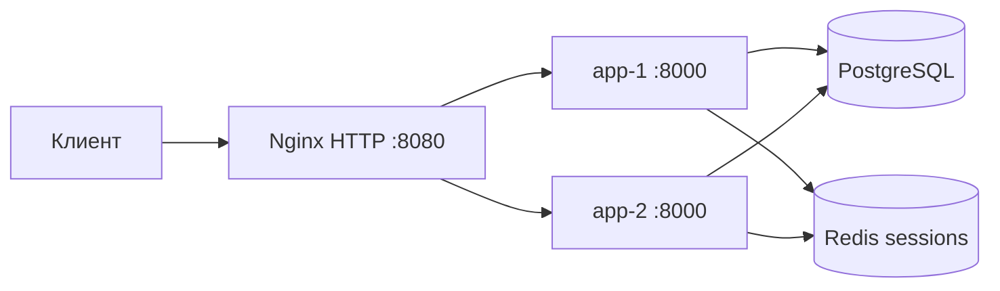

# Архитектура t2-mobile

## Почему так

- Два одинаковых экземпляра приложения — требование работы №2 и задел под балансировщик работы №3.
- PostgreSQL общий: баланс, тарифы и обращения не привязаны к ноде.
- Redis общий: сессия переживает падение app-1 или app-2.
- TLS на приложении нет: uvicorn слушает HTTP, `SESSION_COOKIE_SECURE=false`.
- Идентичность ноды: заголовок `X-Backend-Instance`, страница `/status`, поле `handled_by` у платежей и тикетов.

## Одновременный старт нод

Ноды поднимаются параллельно и обе пытаются создать схему и демо-данные. Чтобы это
не приводило к гонке, `prepare_schema()` берёт advisory-блокировку PostgreSQL
(`pg_advisory_lock`): схему создаёт тот, кто занял ключ первым, остальные ждут и
видят уже готовые таблицы. Перед этим нода ждёт PostgreSQL и Redis с повторами —
в Docker Swarm нет `depends_on`, и порядок запуска сервисов не гарантирован.

## Поведение при падении ноды

В `deploy/local/nginx.conf` выставлены `proxy_connect_timeout 2s` и
`proxy_next_upstream`: запрос к остановленной ноде уходит на живую максимум через
две секунды вместо дефолтных шестидесяти. POST по умолчанию не повторяется, поэтому
пополнение баланса не может задвоиться. `worker_processes 1` нужен для наглядности:
у каждого воркера свой счётчик round-robin, и на восьми воркерах чередование нод в
коротком тесте выглядит случайным.

## Наблюдаемость

Приложение отдаёт метрики Prometheus на `/api/metrics`. Каждая серия помечена меткой
`instance_id`, поэтому запрос `sum by (instance_id) (t2_http_requests_total)` показывает,
как балансировщик распределил нагрузку между нодами.

Метка маршрута берётся из шаблона пути, а не из сырого URL: `/api/v1/coverage/probe/Казань`
превращается в `/api/v1/coverage/probe/{city}`. Иначе каждый город создавал бы отдельный
временной ряд и число метрик росло бы бесконтрольно.

Стек сбора метрик описан в `deploy/lab6/`.
