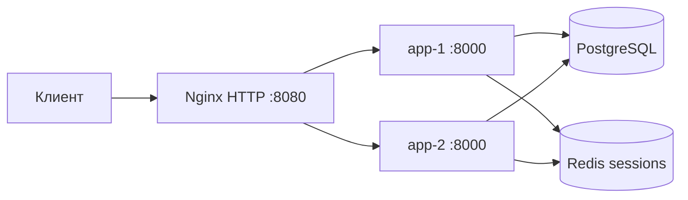

# Архитектура t2-mobile

## Почему так

- Два одинаковых экземпляра приложения — требование работы №2 и задел под балансировщик работы №3.
- PostgreSQL общий: баланс, тарифы и обращения не привязаны к ноде.
- Redis общий: сессия переживает падение app-1 или app-2.
- TLS на приложении нет: uvicorn слушает HTTP, `SESSION_COOKIE_SECURE=false`.
- Идентичность ноды: заголовок `X-Backend-Instance`, страница `/status`, поле `handled_by` у платежей и тикетов.
